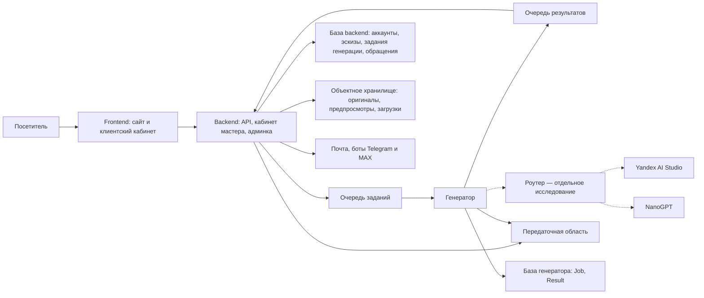

# ADR-0001: Генератор эскизов и личный кабинет клиента

- **Статус:** продуктовый сценарий согласован; инженерная часть утверждается
  сверху вниз по пяти уровням [ADR-0009](0009-system-composition.md):
  уровни 1–3 приняты (ADR-0009 состав, ADR-0010 данные, ADR-0011 и ADR-0012
  контракты), уровни 4–5 (исполнение, инфраструктура) впереди.
- **Дата:** 2026-09-09, уточнён 2026-09-11 (проход 3 по свип-ревью: термины,
  схема, факты репозитория, указатели на принятые ADR).
- **Принимает решение:** владелец проекта.
- **Состояние реализации:** генератор и кабинет отсутствуют в текущем коде.

## Контекст

Посетитель Rated Tattoo должен получить изображение эскиза татуировки по своему
описанию и в заданном стиле. Он сможет доработать рисунок, сохранить варианты
и обратиться к мастеру с выбранным эскизом.

Сейчас сайт работает на React 18 и Vite. GitHub Pages публикует результат сборки
из `dist/`. Собственной серверной части и учётных записей клиентов в репозитории
нет. Форма записи отправляет имя, телефон и описание идеи в Formspree;
сохранение эскиза и передача изображения в этой форме не реализованы.

Исходный код для сверки: `eaa5003`, коммит `master` от 2026-07-23. На дату
первой редакции документ писался в ветке `feat/contacts-map` с тем же деревом
файлов; с 2026-09-09 документы проектирования живут в ветке
`feat/tattoo-generator`, а код сайта в `master` не менялся (повторная
проверка 2026-09-11). Это исходная точка документа, а не ветка реализации
генератора.

Владелец сообщил о доступе к NanoGPT и предоставил документацию Image API.
Затем выбрал Yandex Cloud для размещения сервера и генератора
и предложил также использовать API Яндекса для изображений и рассуждений.
Последующим уточнением владелец потребовал хранить все данные проекта
в Yandex Cloud из-за сбора персональных данных клиентов. Передачу клиентских
заданий в NanoGPT после этого уточнения не считаем выбранным решением.
Владелец выделил выбор моделей и роутера между Яндексом и NanoGPT
в отдельное исследование, устройство сервера — в отдельный трек проектирования.
Конкретные модели ещё не выбрали; платные генерации не запускали.

## Согласованный сценарий

Владелец подтвердил следующий путь посетителя в обсуждении 2026-09-09:

1. Посетитель получает первый эскиз без регистрации.
2. Для сохранения эскиза в кабинете и продолжения работы посетитель входит
   в существующий аккаунт или создаёт новый.
3. После входа переносим уже созданный эскиз в этот аккаунт. Повторно генерировать
   рисунок для сохранения не требуется.
4. В кабинете клиент видит свои эскизы, исходные описания и стили, историю
   вариантов; может вернуться к выбранной версии и продолжить её доработку.
5. Клиент выбирает эскиз и передаёт его мастеру при обращении. На этом этапе
   телефон обязателен; для генерации и входа в кабинет телефон не требуем.
6. Скачивание эскиза клиентом не предусматриваем как функцию сайта.
   На клиентском изображении размещаем водяной знак Rated Tattoo,
   который перекрывает часть рисунка.
7. Для получения обращений мастером поддерживаем email, Telegram и MAX.
   Владелец утвердил уведомления со ссылкой на вход: контакты и изображение
   доступны мастеру после авторизации на сайте.
8. Клиент может загрузить собственный эскиз для мастера или как вход модели.
9. Сохранённые работы пока храним без удаления по возрасту. Клиент может
   удалить свои эскизы, при этом сервис тоже удаляет работы и их копии.
   Гостевые результаты живут только в пределах одной сессии.

Позже владелец добавил к сценарию (ADR-0009 и ADR-0010, 2026-09-09/10):
роль администратора и административный интерфейс в backend; справочник
«Тип клиента», который ставит мастер или администратор; «Запись» — журнал
сеансов мастера, клиент видит свои будущие сеансы только для чтения
(ADR-0012, `GET /me/appointments`). В путь посетителя выше они не входят,
но принадлежат тому же продукту (решения владельца 2026-09-09 по
«Источникам» ADR-0010).

Для регистрации обязательны email, имя, фамилия и пароль. Сообщение мастеру
необязательно. Правила формы описывает
[ADR-0002](0002-sign-in-and-guest-sketch-ownership.md).

**Попытки:** одна без регистрации, после регистрации ещё три. Далее
предусмотрено восстановление запаса; предложен интервал шесть часов,
порядок восстановления уточняется в
[ADR-0006](0006-generation-attempts-and-usage.md). Денежный бюджет владелец
определяет после запуска по фактическому использованию.

**Вход:** email и пароль в первом выпуске, Яндекс после запуска.

**Выбранное размещение:** backend и генератор работают в Yandex Cloud.
Все серверные хранилища данных приложения, включая файлы, журналы
и резервные копии, размещаем в Yandex Cloud в России.
Генератор — самостоятельный внутренний сервис
([ADR-0008](0008-independent-generation-service.md)), который готовит
запросы к моделям, вызывает их через роутер и передаёт результат backend
через передаточную область; оригиналом владеет backend. Границы заданы
[ADR-0009](0009-system-composition.md) и
[ADR-0010](0010-data-and-ownership.md); варианты использования моделей
и исходное предложение обязанностей описаны в
[ADR-0004](0004-yandex-cloud-and-generation-harness.md), где генератор
назван «харнессом».
**Разработка:** SourceCraft принят как основная площадка репозитория
и сборок в [ADR-0005](0005-sourcecraft-repository-and-delivery.md).

## Предлагаемое архитектурное решение

Этот раздел задаёт направление инженерной работы. Выбор библиотек, моделей
и устройство сервера рассматриваем в отдельных треках. Состав системы
принят [ADR-0009](0009-system-composition.md); схема ниже приведена к его
таблице частей 2026-09-11 (проход 3), первоначальная схема с прямой стрелкой
«сервер → харнесс» и доступом генератора к записям и картинкам заменена.

Сайт, backend и генератор размещаем в Yandex Cloud (сайт — по решению
владельца 2026-09-10 в ADR-0009 «Следствия»). Backend проверяет доступ
к эскизам, учитывает попытки и расходы. Генератор обращается к моделям
через роутер. Исследуем маршруты Yandex AI Studio и NanoGPT, включая
создание и правки, условия обработки и удаления данных. Секреты доступа
к сервисам доступны только серверной стороне.

На схеме показаны части системы по таблице ADR-0009 и рассматриваемые
сервисы моделей. Backend и генератор не вызывают друг друга напрямую:
обмен идёт через две очереди, файлы — через передаточную область
объектного хранилища (ADR-0010 «Обмен между backend и генератором»,
«Файлы»). У генератора нет доступа к базе backend и клиентской области
хранилища. Площадка всех частей — Yandex Cloud в России. Конкретные
облачные сервисы, базу данных, язык серверной части и модели ещё
не выбирали (уровни 4–5). Раздельные блоки не требуют отдельных серверов.
Внешние передачи рассматриваем отдельно в ADR-0004; пунктир показывает
исследуемые маршруты, а не выбранную интеграцию.

Владелец выбрал самостоятельный внутренний генератор в
[ADR-0008](0008-independent-generation-service.md). Границы доступа
к хранилищам и обмена между двумя сервисами определены в ADR-0010,
контракт обмена — в [ADR-0011](0011-generation-execution-contract.md).

### Создание и доработка

Для первой версии предлагаем формировать запрос из описания посетителя,
выбранного стиля и общего шаблона требований к эскизу. После предложения
владельца исследуем текстовую модель для подготовки этого задания.
Она должна сохранять пожелания посетителя и помогать получить
отдельный рисунок на нейтральном фоне. Точный состав шага и режим рассуждений
предложены в [ADR-0004](0004-yandex-cloud-and-generation-harness.md).

Для новой версии передаём выбранной графической модели чистый оригинал
или загруженный клиентом эскиз и инструкцию пользователя.
В NanoGPT для этого предусмотрен `input_references`
у поддерживающих входные изображения моделей. В проверенном справочнике
Yandex AI Studio маршрут редактирования пока помечен как недоступный.
Техническая возможность NanoGPT не подтверждает допустимость передачи
клиентских заданий с учётом нового требования хранения.
Точность локальных правок и сохранение композиции проверяем на примерах
татуировок перед выбором модели; генерация по новому тексту не заменяет
доработку выбранного изображения.

Сохраняем предыдущую версию при доработке. Новую версию связываем с той,
от которой клиент начал изменение: работа может продолжаться и от старого
варианта. Каждую генерацию учитываем как отдельное задание генерации
(ADR-0010), в том числе когда она завершилась ошибкой или результат ещё
неизвестен.

### Гостевой результат и личный кабинет

До входа сервер должен связать результат с гостевой сессией: временным доступом
посетителя в текущем браузере. После входа присоединяем этот результат
к подтверждённому аккаунту. Одного знания адреса картинки или номера эскиза
недостаточно для присоединения.

Повторное завершение входа в тот же аккаунт должно возвращать уже присоединённый
эскиз. При входе в другой аккаунт гостевая сессия не даёт права забрать этот
эскиз у прежнего владельца. Если генерация завершится во время входа,
готовый результат тоже должен стать доступен этому клиенту. Механизм
сессии и правила этих переходов прорабатываем в
[ADR-0002](0002-sign-in-and-guest-sketch-ownership.md).

Для кабинета нужны записи о клиенте, эскизе, версиях и заданиях генерации
(полный перечень сущностей — ADR-0010 «Сущности backend»).
Файлы изображений сохраняем под контролем приложения, чтобы срок жизни
внешней ссылки провайдера моделей не определял доступность рисунка в кабинете.
Сохранённые работы не удаляем по возрасту; удаление по команде клиента
и очистку гостевых данных описывает
[ADR-0007](0007-sketch-storage-uploads-and-deletion.md). Для клиентского просмотра
предлагаем отдельную копию с встроенным водяным знаком; чистый оригинал
не выдаём в клиентский браузер. Границы такого ограничения описаны
в [ADR-0003](0003-sketch-preview-and-artist-handoff.md).

### Передача мастеру

К обращению прикладываем выбранную версию, пожелания и обязательный телефон
клиента. Последующие доработки эскиза не должны подменять отправленный вариант.
Мастер получает чистый оригинал этой версии после входа в приложение.
Владелец утвердил каналы email, Telegram и MAX для уведомлений без контактов
и вложений. Получателей задаёт администратор записью «Получатель
уведомлений» (ADR-0010); мастер входит в backend с ролью (ADR-0009);
готовность каналов ещё предстоит определить. Можно передать собственный загруженный
эскиз без предварительной генерации; сообщение мастеру необязательно.
Правила просмотра и передачи описаны в
[ADR-0003](0003-sketch-preview-and-artist-handoff.md).
Текущая интеграция Formspree пока передаёт только текстовые поля.

## Основания и альтернативы

| Вариант | Последствие | Текущий вывод |
| --- | --- | --- |
| Генератор без аккаунтов | Возвращение к эскизам и доступ с другого устройства потребуют отдельного механизма | Не соответствует согласованному кабинету |
| Обязательный вход перед первым результатом | Посетитель должен создать аккаунт до знакомства с результатом генерации | Владелец согласовал первый результат до входа |
| Гостевой результат с последующим входом | Потребуются временное хранение и безопасное присоединение эскиза к аккаунту | Согласованный сценарий |
| Существующий сайт и дополнительная серверная часть | GitHub Pages публикует статический интерфейс, сервер и данные размещаем в России | Рассматривали до уточнения владельца о хранении всего проекта. Форма «статический frontend + отдельный backend» затем выбрана в ADR-0009; площадка статики — следующая строка |
| Размещение сайта и серверной части в Yandex Cloud | Потребуется изменить публикацию сайта и заменить отправку формы в Formspree | Принято: ADR-0009 «Следствия» (2026-09-10) — статика переезжает в Yandex Cloud вслед за backend; способ публикации — уровень 5 |

## Ограничения NanoGPT и границы проверки

Документация рекомендует `POST /api/v1/images` для новых интеграций. Один маршрут
обслуживает создание по тексту и работу с входными изображениями для моделей,
которые поддерживают эти возможности. Параметры и цены зависят от модели;
проверяем их через каталог и возвращённую им ссылку на метаданные модели.

В документированном маршруте нет потоковой выдачи изображения. Для интерфейса
нужно состояние ожидания; проценты готовности документация не обещает.
Способ выполнения долгих запросов, восстановления после разрыва связи
и получения статуса задания выбран на уровнях 2–3: очереди и доставка
минимум один раз (ADR-0010), состояния задания и неизвестный исход
(ADR-0011 §2–3), опрос состояния эскиза клиентом (ADR-0012 §6).

Публичный каталог прочитан 2026-09-09. Форма `supported_parameters` в живом
ответе отличается от примера документации: встречаются `resolutions`,
`max_output_images` и `max_input_images`. Пример JSON не используем как готовый
контракт интеграции. Формат успешного ответа генерации, срок доступности файлов,
поведение выбранной модели и фактические списания ещё не проверены.

Возможности и ограничения API Yandex AI Studio рассмотрены отдельно
в [ADR-0004](0004-yandex-cloud-and-generation-harness.md).

## Последствия для проекта

- Понадобятся сервер, хранение клиентских данных и изображений, наблюдение
  за ошибками и расходами, а также порядок восстановления сохранённых работ.
- Лимиты попыток заданы владельцем; детали восстановления уточняются.
  Денежный бюджет определяем по факту после запуска. Учёт использования
  должен работать с первого выпуска. Повторный клик или сетевой повтор
  не считаем новой оплачиваемой попыткой автоматически (закреплено ключом
  идемпотентности: ADR-0011 §1, ADR-0012 §4).
- При неизвестном исходе платного запроса нельзя обещать безопасный повтор:
  сначала определяем, может ли выбранный сервис сообщить исход или устранить
  дублирование. Автоматическая отправка в другой сервис также может создать
  второе списание.
- Сохраняем доступ к кабинету и существующим эскизам при недоступности генерации.
- Для проверки потребуются сценарии владения данными, присоединения гостевого
  результата, истории версий и повторных запросов. Сейчас тестового набора
  для такой серверной функциональности в проекте нет.

## Открытые решения

Обсуждаем решения по одному; согласие с этим черновиком не выбирает перечисленные
ниже параметры автоматически.

| Решение | Что нужно определить | Что от него зависит |
| --- | --- | --- |
| Вход и сессия | Подтверждение почты и момент начисления попыток (открыто); восстановление пароля — уровень 4. Сеансы и перенос результата решены ADR-0010/0012 | Возвращение клиента и владение эскизом |
| Устройство сервера | Уровни 4–5 по ADR-0009: языки, библиотеки, база, очередь, фоновые задания, запуск, инфраструктура и выпуск | Выполнение и обслуживание приложения |
| Модели и роутер | Отдельное исследование LiteLLM и собственного роутера между Яндексом и NanoGPT | Качество, скорость, стоимость и условия обработки |
| Выполнение и попытки | Восстановление запаса (открыто, ADR-0006). Статусы, резервирование и повторы решены ADR-0010/0011 | Поведение при сбоях и контроль списаний |
| Загрузка и удаление | Численные ограничения файлов и срок гостевой сессии (уровень 4), резервные копии и восстановление. Области, очистка копий и гонки с генерацией решены ADR-0010/0011/0012 | Сохранность работ и выполнение удаления |
| Просмотр и обращение | Оформление знака, готовность каналов. Получатели — ADR-0010, доступ мастера — ADR-0009, обращение — ADR-0012 §8 | Выбор рисунка и работа с обращением |

Требования владельца не требуют повторного выбора. Инженерная часть
утверждается по пяти уровням ADR-0009; уровни 1–3 приняты, впереди
уровни 4–5. Отдельно продолжается
[исследование роутера](../research/model-router.md); прежний
[серверный трек](../design/server-runtime.md) сведён к уровням 4–5.

## Источники

- Проход 3 по свип-ревью 2026-09-11 (пункты A-1…A-22, «A-вне»): «харнесс»
  → «генератор», «операция» → «задание генерации», схема приведена
  к составу ADR-0009, факты репозитория и таблицы направления и открытых
  решений обновлены указателями на ADR-0009…0012. Согласованный сценарий
  и решения владельца не менялись; дополнения к сценарию из ADR-0009/0010
  перечислены отдельным абзацем после пути посетителя.
- Последние решения владельца 2026-09-09: одна гостевая попытка и три после
  регистрации с последующим восстановлением; бюджет по факту; email и пароль
  сразу, Яндекс позже; имя и фамилия обязательны; сообщение необязательно;
  схема доступа мастера утверждена; загрузка своих эскизов, хранение без срока
  до удаления пользователем и гостевое хранение в сессии; SourceCraft принят;
  роутер и устройство сервера выделены в самостоятельные инженерные треки.

- Решения владельца в обсуждении 2026-09-09: изображение эскиза в заданном стиле;
  регистрация с кабинетом; первый результат до входа с последующим переносом
  в аккаунт; форма клиента помимо email и допустимость входа через email
  или Яндекс; телефон при обращении к мастеру; отсутствие клиентской функции
  скачивания и водяной знак поверх части эскиза; доставка мастеру через
  email, Telegram и MAX; размещение сервера и генератора (тогда — «харнесса»)
  в Yandex Cloud и предложение использовать API Яндекса для генерации
  и рассуждений;
  обязательное хранение всех данных проекта в Yandex Cloud из-за сбора
  персональных данных клиентов.
- [ADR-0004: размещение и модели](0004-yandex-cloud-and-generation-harness.md),
  включая проверенные ссылки на документацию Yandex Cloud и AI Studio.
- [Правила проекта](../../CLAUDE.md), [композиция сайта](../../src/app.jsx),
  [секции и форма записи](../../sections.jsx),
  [публикация сайта](../../.github/workflows/static.yml).
- [NanoGPT Image API](https://docs.nano-gpt.com/api-reference/image-generation).
- [NanoGPT: Generate Images](https://docs.nano-gpt.com/api-reference/endpoint/image-api-generate).
- [NanoGPT: метаданные и цены модели](https://docs.nano-gpt.com/api-reference/endpoint/image-api-model-endpoints).
- [Публичный каталог моделей NanoGPT](https://nano-gpt.com/api/v1/images/models).
- [GitHub Pages: статическая публикация сайта](https://docs.github.com/en/pages/getting-started-with-github-pages/what-is-github-pages).
